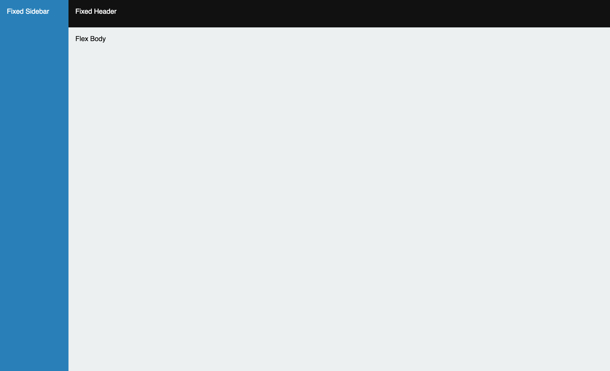
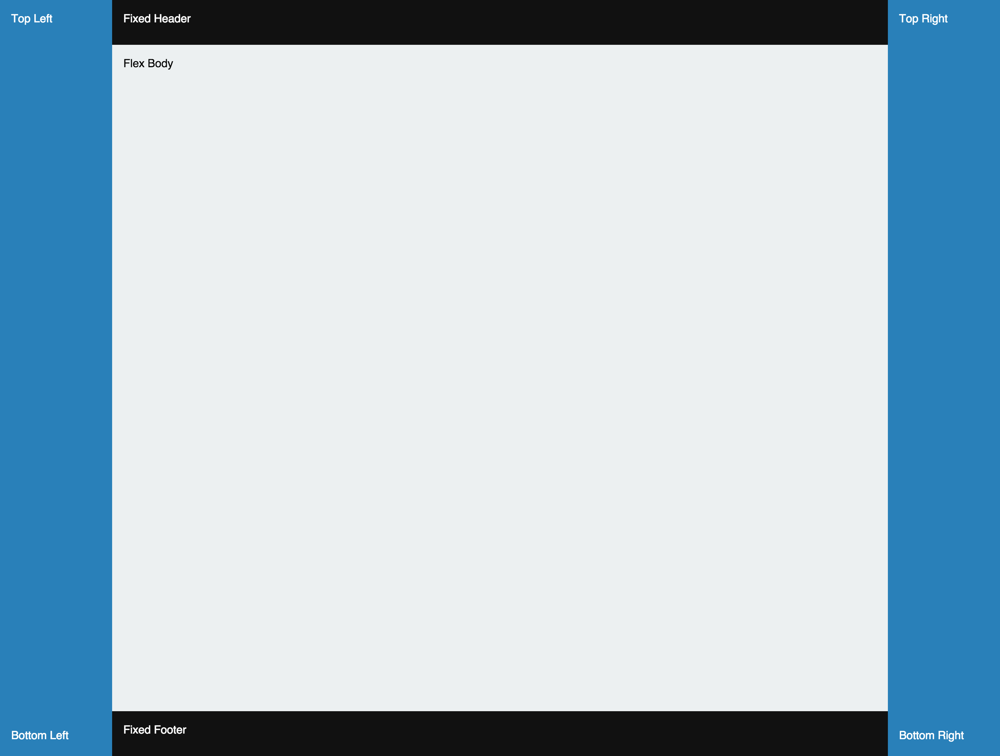
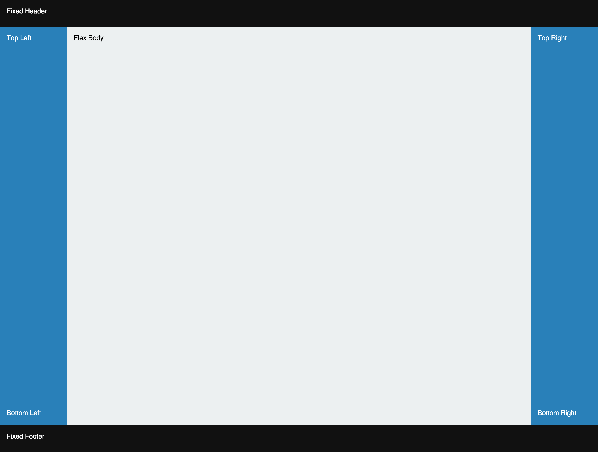

# react-layout

React layout component using flexbox.

## Example 1


<div align="center">
  
</div>


```html
   <Layout type="rows">
       <Fixed className="header">
           Fixed Header
       </Fixed>
       <Flex className="content">
           Flex Body
       </Flex>
   </Layout>
```


## Example 2


<div align="center">
   
</div>


```html
   <Layout type="rows">
       <Fixed className="header">Fixed Header</Fixed>
       <Flex>
           <Layout type="columns">
               <Fixed className="sidebar">Fixed Sidebar</Fixed>
               <Flex className="content">Flex Body</Flex>
           </Layout>
       </Flex>
   </Layout>
```


## Example 3


<div align="center">
  
</div>


```html
    <Layout type="columns">
        <Fixed className="sidebar">Fixed Sidebar</Fixed>
        <Flex>
            <Layout type="rows">
                <Fixed className="header">Fixed Header</Fixed>
                <Flex className="content">Flex Body</Flex>
            </Layout>
        </Flex>
    </Layout>
```


## Example 4


<div align="center">
  
</div>


```html
    <Layout type="columns">
        <Fixed className="sidebar">
            <Layout type="rows">
                <Fixed>
                    Top Left
                </Fixed>
                <Flex>
                </Flex>
                <Fixed>
                    Bottom Left
                </Fixed>
            </Layout>
        </Fixed>
        <Flex>
            <Layout type="rows">
                <Fixed className="header">
                    Fixed Header
                </Fixed>
                <Flex className="content">
                    Flex Body
                </Flex>
                <Fixed className="header">
                    Fixed Footer
                </Fixed>
            </Layout>
        </Flex>
        <Fixed className="sidebar">
            <Layout type="rows">
                <Fixed>
                    Top Right
                </Fixed>
                <Flex>
                </Flex>
                <Fixed>
                    Bottom Right
                </Fixed>
            </Layout>
        </Fixed>
    </Layout>
```


 ## Example 5


 <div align="center">
   
 </div>


```html
    <Layout type="rows">
        <Fixed className="header">
            Fixed Header
        </Fixed>
        <Flex>
            <Layout type="columns">
                <Fixed className="sidebar">
                    <Layout type="rows">
                        <Fixed>
                            Top Left
                        </Fixed>
                        <Flex>
                        </Flex>
                        <Fixed>
                            Bottom Left
                        </Fixed>
                    </Layout>
                </Fixed>
                <Flex className="content">
                    Flex Body
                </Flex>
                <Fixed className="sidebar">
                    <Layout type="rows">
                        <Fixed>
                            Top Right
                        </Fixed>
                        <Flex>
                        </Flex>
                        <Fixed>
                            Bottom Right
                        </Fixed>
                    </Layout>
                </Fixed>
            </Layout>
        </Flex>
        <Fixed className="header">
            Fixed Footer
        </Fixed>
    </Layout>
 ```


## CSS


```css
    *, *:before, *:after {
        -moz-box-sizing: border-box;
        -webkit-box-sizing: border-box;
        box-sizing: border-box;
    }

    * {
        position: relative;
    }

    html, body {
        font-size: 16px;
        line-height: 1.5rem;
        height: 100%;
        min-height: 100%;
    }

    .header {
        padding: 1rem;
        background: #111;
        height: 4rem;
        color: #fff;
    }

    .sidebar {
        padding: 1rem;
        background: #2980B9;
        width: 8rem;
        color: #fff;
    }

    .content {
        padding: 1rem;
        background: #ECF0F1;
    }
```
